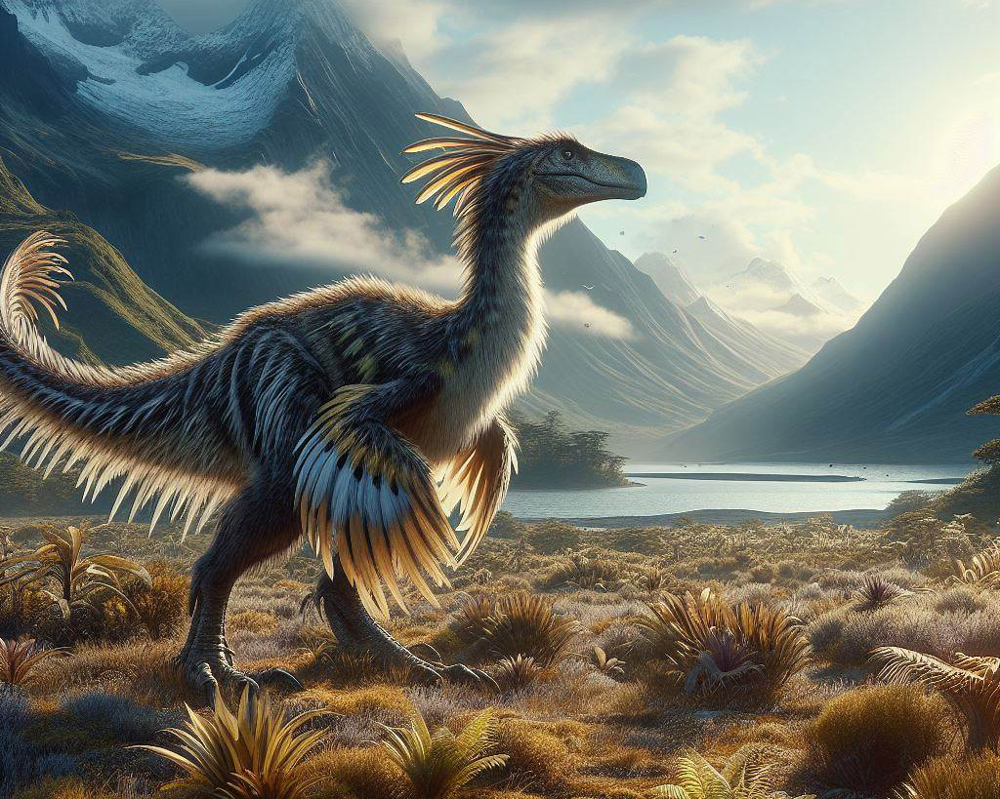

# 

- ${\color{red}T} im {\color{red}e}\ Se {\color{red}r} ies\ Extracti {\color{red}o} n\ for\ {\color{red}Po} lygonal\ {\color{red}Da} ta$

### Name
- T(h)eroPoDa - Time Series Extraction for Polygonal Data ⬛

### Description
- Toolkit created to extract Time Series information from Sentinel 2 🛰 data stored in Earth Engine 

### Author
- Vinícius Vieira Mesquita - vieiramesquita@gmail.com

### Version
- 1.0.6

### How to use

- At this version of TheroPoDa (1.0.5), you could extract a series of NDVI data from Sentinel 2 for a Feature Collection of polygons simplily by adjusting some variables at the end of the Google Colab code below:

| variable      | usage                                               | example  |
|:-------------:|:--------------------------------------------------: |:---------|
| asset         | Choosed Earth Engine Vector Asset                   | users/vieiramesquita/LAPIG_FieldSamples/lapig_goias_fieldwork_2022_50m |
| id_field      | Vector column used as ID (use unique identifiers!) | ID_POINTS |
| output_name   | Output filename                                     | LAPIG_Pasture_S2_NDVI_Monitoring_FieldWork.csv |

### Roadmap

- Implement arguments to choose other zonal reducers (i.e. percentile, variance, etc.)
- Implement arguments to choose other satellite data series (i.e. Landsat series)
- Implement a visualization of the processed data (or samples of it)
